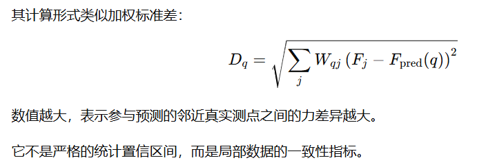
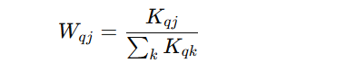

# 01 真实霍尔测点三维坐标

# 02 霍尔芯片计算出的力 (N)

# 03 YLZ 三维各向异性排斥核参数

$\varepsilon$ 是不是可以不用设置了
rmin是接近真实测点的数据
rc是阶段半径
$\zeta$ 是陡峭程度
$\mu$ 是角度函数的线性方法系数
$\beta$ 是方向偏置参数

\repsilons 是最近的范围
weight_tol 权重容差
coincide_tol 距离容差

# 04 设置真实测点的三维方向向量

% 单独一个坐标点不能唯一确定方向，因此需要指定方向参考点 O。
%
% 当前采用径向方向模型：
%
%   n_t = (X_t - O)/||X_t - O||
%
% 这里把方向参考点放在测点几何中心下方。
% direction_origin_depth 应根据实际结构中的等效方向中心进行调整

 **这里我要改的，我觉得参考点应该是可以在(0,0,0)的，等我看完所有的code就改** 
 有一个取参考点的过程，我试试不同的参考点的值会有什么影响

# 05 创建三维连续预测网格
    创建了一个20*20*10的空间用于预测

# 06 设置三维虚拟点的方向向量

这里和04一致

# 7. 使用“虚拟点 -> neighbors -> 真实点”的双层循环预测
% 外层循环：
%   逐个处理虚拟点 q。
%
% 内层循环：
%   只处理三维直线距离 r < r_c 的真实邻居 j。
%
% 函数内部会明确计算：
%   n_v、n_t、h_tv、r、r_hat、u_R、a、phi、K_qj，
% 然后再对当前虚拟点的全部邻居进行归一化加权。

## 预测函数 predictYLZField3DNeighbors
### info
输入是：虚拟点的坐标、单位方向向量，真实测点的坐标、单位方向向量还有测量值，YLZ势函数所需的参数

输出：F_pred, F_dispersion, K, W, NeighborList, GeometricNeighborCount, ActiveKernelCount

局部加权离散散度：F_dispersion

完整核值矩阵：K, 

归一化权重矩阵：W, 

NeighborList, 

GeometricNeighborCount, 查询点的几何邻居数量

ActiveKernelCount 查询点实际有效的核数量

### 输入检查

### 预处理 
    归一化三维方向向量

### 外层循环：逐个虚拟点进行预测

### 输入检查